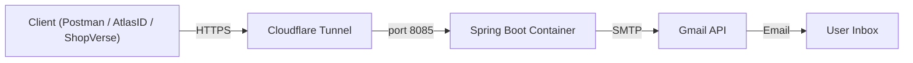
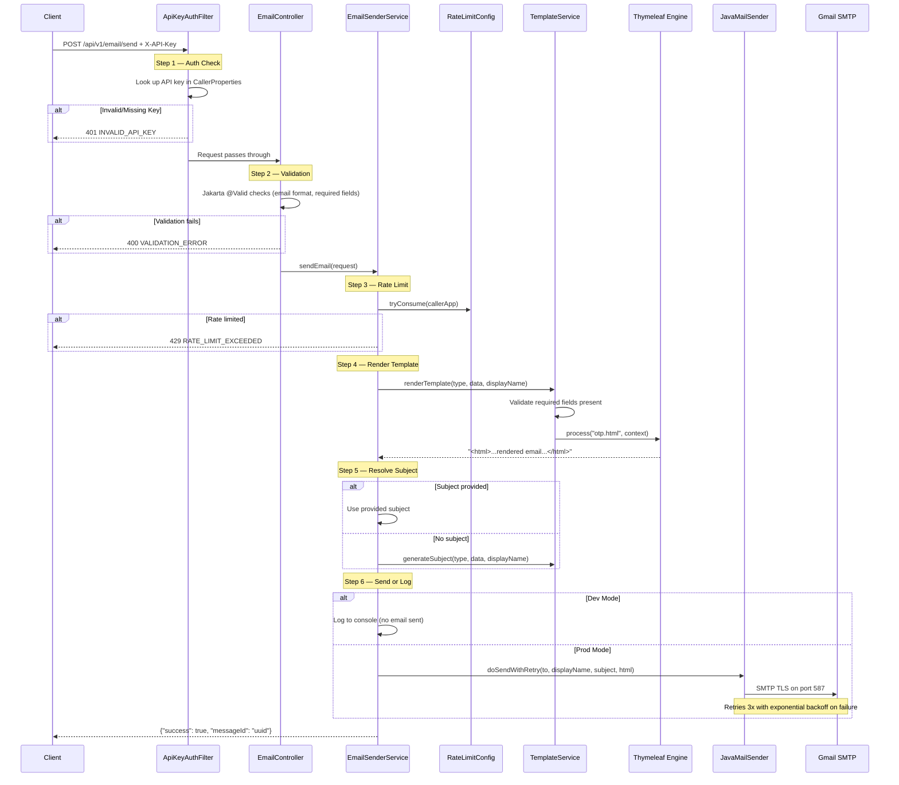
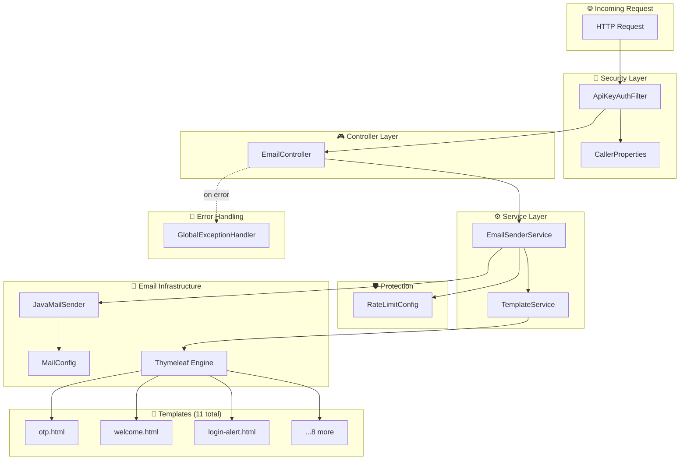

# 📧 Email Service — Architecture

## System Overview



---

## Request Flow — What happens when you call `/send`



---

## Component Map



---

## File-by-File Breakdown

### Security Layer

| File | Purpose |
|------|---------|
| [ApiKeyAuthFilter](file:///c:/Users/Shivansh/Desktop/PROzz/emailService/src/main/java/com/shivansh/emailservice/filter/ApiKeyAuthFilter.java) | Intercepts every request, checks `X-API-Key` header against registered callers. Skips check in dev mode. |
| [CallerProperties](file:///c:/Users/Shivansh/Desktop/PROzz/emailService/src/main/java/com/shivansh/emailservice/config/CallerProperties.java) | Loads caller app registrations from `application.yml` (name, API key, display name, rate limit). |
| [SecurityConfig](file:///c:/Users/Shivansh/Desktop/PROzz/emailService/src/main/java/com/shivansh/emailservice/config/SecurityConfig.java) | Registers the `ApiKeyAuthFilter` into the filter chain, excludes `/health` from auth. |

### Controller Layer

| File | Purpose |
|------|---------|
| [EmailController](file:///c:/Users/Shivansh/Desktop/PROzz/emailService/src/main/java/com/shivansh/emailservice/controller/EmailController.java) | 4 endpoints: `POST /send`, `POST /send-batch`, `GET /types`, `GET /health`. Delegates to `EmailSenderService`. |

### Service Layer

| File | Purpose |
|------|---------|
| [EmailSenderService](file:///c:/Users/Shivansh/Desktop/PROzz/emailService/src/main/java/com/shivansh/emailservice/service/EmailSenderService.java) | Orchestrates the full flow: rate limit → render template → resolve subject → send/log. Contains `@Retryable` for SMTP retries. |
| [TemplateService](file:///c:/Users/Shivansh/Desktop/PROzz/emailService/src/main/java/com/shivansh/emailservice/service/TemplateService.java) | Validates required fields, renders Thymeleaf HTML templates, auto-generates subjects. |

### Config

| File | Purpose |
|------|---------|
| [MailConfig](file:///c:/Users/Shivansh/Desktop/PROzz/emailService/src/main/java/com/shivansh/emailservice/config/MailConfig.java) | Configures `JavaMailSender` bean for Gmail SMTP (TLS, port 587, auth). |
| [RateLimitConfig](file:///c:/Users/Shivansh/Desktop/PROzz/emailService/src/main/java/com/shivansh/emailservice/config/RateLimitConfig.java) | In-memory Bucket4j rate limiter. Per-caller limits configurable in YAML. |
| [SwaggerConfig](file:///c:/Users/Shivansh/Desktop/PROzz/emailService/src/main/java/com/shivansh/emailservice/config/SwaggerConfig.java) | OpenAPI docs with API key security scheme. Disabled in prod. |

### Models

| File | Purpose |
|------|---------|
| [EmailType](file:///c:/Users/Shivansh/Desktop/PROzz/emailService/src/main/java/com/shivansh/emailservice/model/EmailType.java) | Enum of 11 types, each defining template name + required/optional fields. |
| [EmailRequest](file:///c:/Users/Shivansh/Desktop/PROzz/emailService/src/main/java/com/shivansh/emailservice/model/EmailRequest.java) | DTO: `to`, `type`, `callerApp`, `subject`, `templateData`. |
| [EmailResponse](file:///c:/Users/Shivansh/Desktop/PROzz/emailService/src/main/java/com/shivansh/emailservice/model/EmailResponse.java) | DTO: `success`, `messageId`, `timestamp`, `error`. |

### Error Handling

| File | Purpose |
|------|---------|
| [GlobalExceptionHandler](file:///c:/Users/Shivansh/Desktop/PROzz/emailService/src/main/java/com/shivansh/emailservice/exception/GlobalExceptionHandler.java) | Catches all exceptions and returns clean `EmailResponse` — never leaks stack traces. |

---

## Infrastructure

```mermaid
graph LR
    subgraph "Your PC"
        CODE["Source Code"] -->|git push| GH["GitHub"]
    end

    subgraph "GitHub"
        GH -->|triggers| GA["GitHub Actions"]
        GA -->|builds + pushes| GHCR["ghcr.io/thebrownhuman/emailserver:latest"]
    end

    subgraph "NUC Homelab"
        WT["Watchtower"] -->|auto-pulls| GHCR
        WT -->|restarts| DOCK["Docker: email-service :8085"]
        CF["cloudflared"] -->|routes| DOCK
    end

    subgraph "Internet"
        USER["Any Client"] -->|HTTPS| CFL["Cloudflare CDN"]
        CFL -->|tunnel| CF
    end
